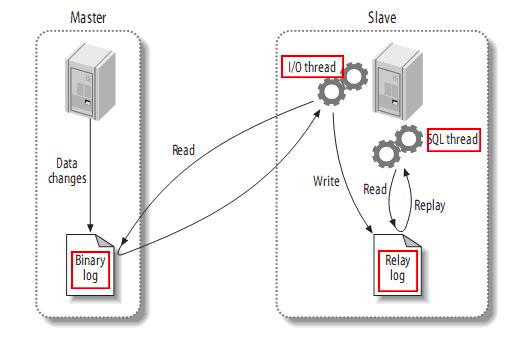

### 基本操作
* 创建容器  `docker run -p 3306:3306 -d --name mysql-master -e MYSQL_ROOT_PASSWORD=1234 mysql`
  
* 启动MySQL服务 `sudo /usr/local/MySQL/support-files/mysql.server start`

* 停止MySQL服务 `sudo /usr/local/mysql/support-files/mysql.server stop`

* 重启MySQL服务 `sudo /usr/local/mysql/support-files/mysql.server restart`

* 彻底关闭MySQl进程 `brew services stop mysql`

* 连接mysql `mysql -uroot -p1234 -h127.0.0.1 -P3306`

### 主从复制
[深入理解mysql复制](https://blog.csdn.net/bzhxuexi/article/details/43700329)

#### 复制类型
1. 基于语句的复制：在主服务器上执行的SQL语句，在从服务器上执行同样的语句。MySQL默认采用基于语句的复制，效率比较高。
2. 基于记录(行,Row)的复制：把改变的内容复制过去，而不是把命令在从服务器上执行一遍. 从mysql5.0开始支持。
3. 混合类型的复制: 默认采用基于语句的复制，一旦发现基于语句的无法精确的复制时，就会采用基于行的复制。

#### 复制解决的问题
MySQL复制技术有以下一些特点：
1. 数据分布 (Data distribution)
2. 负载平衡(load balancing)
3. 备份(Backups)
4. 高可用性和容错行(High availability and failover)

#### 复制步骤
1. master将改变记录到二进制日志(binary log)中（这些记录叫做二进制日志事件，binary log events）；
2. slave将master的binary log events拷贝到它的中继日志(relay log)；
3. slave重做中继日志中的事件，将改变反映它自己的数据。

